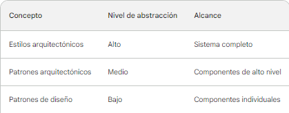

<h1 align="center"> Arquitectura de Software</h1>

## Contenidos:
1. [Introducción a la arquitectura de softwaree](#introducción-a-la-arquitectura-de-software)

2. [Definición](#definición)

3. [Importancia de la arquitectura de software](#importancia-de-la-arquitectura-de-software)

4. [Proceso en el diseño de la arquitectura de software](#proceso-de-diseño-de-arquitectura-de-software)

5. [Los estilos arquitectónicos, patrones arquitectónicos y patrones de diseño](#los-estilos-arquitectónicos-patrones-arquitectónicos-y-patrones-de-diseño)

    - 5.1 [Diferencias entre estilo arquitectónico, patrón arquitectónico y patron de diseño](#diferencias-entre-estilos-arquitectónicos-patrones-arquitectónicos-y-patrones-de-diseño)

    - 5.2 [Uso de los estilos arquitectónicos, patrones arquitectónicos y patrones de diseño](#uso-de-estilos-arquitectónicos-patrones-arquitectónicos-y-patrones-de-diseño)

6. [Conceptos necesarios](#conceptos-necesarios)

    - 6.1 [Atributos de calidad del software](#1-atributos-de-calidad-del-software)

        - 6.1.2 [Atributos de calidad internos](#atributos-de-calidad-internos)

        - 6.1.3 [Atributos de calidad externos](#atributos-de-calidad-externos)

        - 6.1.4 [Otros atributos de calidad](#otros-atributos-de-calidad)

        - 6.1.5 [Importancia de los atributos de calidad](#importancia-de-los-atributos-de-calidad)

        - 6.1.6 [¿Como puedo medir los atributos de calidad en un proyecto?](#¿como-puedo-medir-los-atributos-de-calidad-en-un-proyecto)

    - 6.2 [Acoplamiento](#2-acoplamiento)

        - 6.2.1 [Impacto del acoplamiento](#impacto-del-acoplamiento)

        - 6.2.2 [¿Como puedo reducir el acoplamiento?](#¿como-puedo-reducir-el-acoplamiento)

    - 6.3 [Cohesión](#3-cohesión)

        - 6.3.1 [Importancia de la cohesión](#importancia-de-la-cohesión)

        - 6.3.2 [¿Como mejorar la cohesión de mis proyectos?](#¿como-mejorar-la-cohesión-de-mis-proyectos)

    - 6.4 [Principios SOLID](#4-principios-solid)
## Introducción a la arquitectura de software

La arquitectura de software es la base estructural de cualquier sistema de software, definiendo cómo los componentes del sistema interactúan entre sí y con los usuarios. Para comprender a fondo la arquitectura de software, es necesario explorar varios temas y a lo largo de este material encontrarás varios de estos lo que te ayudará a comprender mejor estos conceptos.

## Definición

La arquitectura de software es el diseño de alto nivel de un sistema de software que abarca la estructura de sus componentes, sus relaciones, y los principios que guían su organización. Es una descripción abstracta de cómo se relacionan los componentes del software y cómo se comunican entre sí.

La arquitectura de software es una parte fundamental del desarrollo de software, ya que proporciona una base sólida para la implementación, el mantenimiento y la evolución del sistema. Una buena arquitectura de software ayuda a garantizar que el sistema cumpla con sus requisitos, sea escalable, adaptable y mantenible.

## Importancia de la arquitectura de software

La arquitectura de software es importante por las siguientes razones:

- Ayuda a garantizar que el sistema cumpla con sus requisitos: La arquitectura de software define cómo se organizarán los componentes del sistema para cumplir con los requisitos funcionales y no funcionales del sistema.

- Evita problemas de diseño: Una buena arquitectura de software ayuda a evitar problemas de diseño, como la falta de escalabilidad o la dificultad de mantenimiento.

- Reduce los costos de desarrollo y mantenimiento: Una buena arquitectura de software puede reducir los costos de desarrollo y mantenimiento al facilitar la adición de nuevas características y la corrección de errores.

## Proceso de diseño de arquitectura de software

El proceso de diseño de arquitectura de software suele seguir los siguientes pasos:

- Definición de los requisitos: El primer paso es definir los requisitos del sistema. Estos requisitos pueden ser funcionales, no funcionales o ambos.

- Estudio de los requisitos: Una vez que se han definido los requisitos, es necesario estudiarlos para comprender cómo se relacionan entre sí.

- Diseño de la arquitectura: El siguiente paso es diseñar la arquitectura del sistema. Esto implica definir los componentes del sistema, sus relaciones y los principios que guían su organización.

- Evaluación de la arquitectura: La arquitectura debe ser evaluada para garantizar que cumpla con los requisitos del sistema.

- Documentación de la arquitectura: La arquitectura debe ser documentada para que pueda ser entendida y utilizada por los desarrolladores, los arquitectos y los usuarios.

## Los estilos arquitectónicos, patrones arquitectónicos y patrones de diseño

Los estilos arquitectónicos, patrones arquitectónicos y patrones de diseño son tres conceptos relacionados con la arquitectura de software. Todos ellos se utilizan para describir y organizar las estructuras de software, pero tienen diferentes niveles de abstracción y alcance.

### Diferencias entre estilos arquitectónicos, patrones arquitectónicos y patrones de diseño

La principal diferencia entre estilos arquitectónicos, patrones arquitectónicos y patrones de diseño es el nivel de abstracción. Los estilos arquitectónicos son el nivel de abstracción más alto, mientras que los patrones de diseño son el nivel de abstracción más bajo.

Los estilos arquitectónicos describen la organización general de un sistema, mientras que los patrones arquitectónicos describen soluciones específicas a problemas de diseño arquitectónico. Los patrones de diseño, por otro lado, describen soluciones específicas a problemas de diseño en el nivel de componentes individuales.

En la siguiente tabla se resumen las principales diferencias entre estos tres conceptos:

  

### Uso de estilos arquitectónicos, patrones arquitectónicos y patrones de diseño

Los estilos arquitectónicos, patrones arquitectónicos y patrones de diseño se pueden utilizar de forma conjunta para diseñar un sistema de software. Los estilos arquitectónicos proporcionan un marco general para pensar en la arquitectura del sistema, mientras que los patrones arquitectónicos y de diseño proporcionan soluciones específicas a problemas de diseño.

Por ejemplo, un arquitecto de software podría utilizar un estilo arquitectónico de microservicios para dividir el sistema en un conjunto de servicios pequeños e independientes. Luego, podría utilizar un patrón arquitectónico de microkernel para separar la lógica de negocio del sistema del núcleo del sistema. Finalmente, podría utilizar patrones de diseño para implementar los componentes individuales del sistema.

El uso de estilos arquitectónicos, patrones arquitectónicos y patrones de diseño puede ayudar a los arquitectos de software a diseñar sistemas de software que sean escalables, mantenibles y adaptables.

Si quieres información detallada y específica sobre alguno de estos temas puedes ingresar a los siguientes links donde podrás encontrar más documentación y ejemplos:

- [Estilos arquitectectónicos](https://github.com/DatBrian/Arquitectura_de_Software/tree/Estilos-Arquitect%C3%B3nicos).
- [Patrones de diseño](https://github.com/DatBrian/Arquitectura_de_Software/tree/Patrones-de-dise%C3%B1o).
- [Patrones arquitectónicos](https://github.com/DatBrian/Arquitectura_de_Software/tree/Patrones-Arquitect%C3%B3nicos).

## Conceptos Necesarios

La arquitectura de software es un tema abstracto que esta compuesto por algunos conceptos claves que son necesarios para entender mejor como funciona y para empezar a aplicarla en nuestros proyectos; dichos conceptos los cuales se recomienda tener claros son los siguientes:

### 1. Atributos de calidad del software

Los atributos de calidad del software son características que determinan la bondad de un producto de software. Estos atributos son importantes para los desarrolladores, los usuarios y las organizaciones que dependen del software.

Los atributos de calidad del software se pueden clasificar en dos categorías principales:

- **Atributos de calidad internos:** Estos atributos se refieren a la estructura y el funcionamiento del software. Incluyen la funcionalidad, la fiabilidad, la eficiencia, la mantenibilidad y la portabilidad.

- **Atributos de calidad externos:** Estos atributos se refieren a la interacción del software con el mundo exterior. Incluyen la usabilidad, la compatibilidad, la seguridad y la accesibilidad.

#### Atributos de calidad internos:

- **Funcionalidad:** El software debe cumplir con los requisitos funcionales especificados por los usuarios.

- **Fiabilidad:** El software debe funcionar correctamente y sin errores durante un período de tiempo especificado.

- **Eficiencia:** El software debe utilizar los recursos de forma eficiente, como la memoria, el procesador y el almacenamiento.

- **Mantenibilidad:** El software debe ser fácil de modificar y actualizar.

- **Portabilidad:** El software debe poder ejecutarse en diferentes entornos.

#### Atributos de calidad externos:

- **Usabilidad:** El software debe ser fácil de aprender, usar y recordar.

- **Compatibilidad:** El software debe poder interactuar con otros sistemas y dispositivos.

- **Seguridad:** El software debe proteger la información y los datos de los usuarios.

- **Accesibilidad:** El software debe ser accesible para personas con discapacidades.

#### Otros atributos de calidad:

Además de los atributos de calidad mencionados anteriormente, existen otros atributos que pueden ser importantes para ciertos tipos de software. Estos atributos incluyen:

- **Cumplimiento:** El software debe cumplir con las leyes y regulaciones aplicables.

- **Cumplimiento de estándares:** El software debe cumplir con los estándares de la industria.

- **Interoperabilidad:** El software debe poder interactuar con otros sistemas y dispositivos.

- **Estética:** El software debe ser agradable a la vista y al uso.

#### Importancia de los atributos de calidad

Los atributos de calidad son importantes para los desarrolladores, los usuarios y las organizaciones que dependen del software. Los desarrolladores necesitan asegurarse de que el software que crean cumpla con los requisitos de calidad para satisfacer las necesidades de los usuarios. Los usuarios necesitan asegurarse de que el software que utilizan sea confiable, seguro y fácil de usar. Las organizaciones necesitan asegurarse de que el software que utilizan sea rentable y productivo.

#### ¿Como puedo medir los atributos de calidad en un proyecto?

Los atributos de calidad se pueden medir de diversas formas. Algunas técnicas comunes incluyen:

- **Pruebas:** Las pruebas se utilizan para identificar errores y defectos en el software.

- **Medición de rendimiento:** La medición de rendimiento se utiliza para determinar la velocidad y la eficiencia del software.

- **Encuestas de usuarios:** Las encuestas de usuarios se utilizan para recopilar comentarios de los usuarios sobre la facilidad de uso y la satisfacción con el software.

### 2. Acoplamiento

En el ámbito del software, el acoplamiento se refiere a la medida en que dos o más componentes de software están relacionados entre sí. Un acoplamiento alto indica que los componentes están estrechamente relacionados, mientras que un acoplamiento bajo indica que los componentes están relativamente independientes.

#### Impacto del acoplamiento

Un alto acoplamiento puede tener un impacto negativo en la calidad del software, ya que puede dificultar la modificación y el mantenimiento del software. Algunos de los problemas asociados a un alto acoplamiento son los siguientes:

- **Dificultad de modificación:** Cualquier cambio en un componente con un alto acoplamiento puede afectar a otros componentes. Esto puede dificultar la modificación del software para satisfacer nuevos requisitos o corregir errores.

- **Dificultad de mantenimiento:** El mantenimiento del software con un alto acoplamiento puede ser difícil y costoso. Esto se debe a que los cambios en un componente pueden requerir cambios en otros componentes.

- **Dificultad de prueba:** El software con un alto acoplamiento puede ser difícil de probar. Esto se debe a que los cambios en un componente pueden afectar a los resultados de las pruebas de otros componentes.

#### ¿Como puedo reducir el acoplamiento?

Existen una serie de técnicas que pueden ayudar a reducir el acoplamiento en el software. Algunas de estas técnicas son las siguientes:

- **Uso de interfaces:** El uso de interfaces puede ayudar a reducir el acoplamiento entre componentes. Las interfaces definen un conjunto de operaciones que un componente puede realizar, pero no revelan la implementación de esas operaciones.

- **Empleo de patrones de diseño:** Los patrones de diseño pueden ayudar a reducir el acoplamiento entre componentes. Los patrones de diseño proporcionan soluciones a problemas comunes de diseño de software.

- **Diseño modular:** El diseño modular puede ayudar a reducir el acoplamiento entre componentes. El diseño modular divide el software en módulos independientes que se comunican entre sí a través de interfaces.

### 3. Cohesión

La cohesión en el ámbito del software es una medida de la fuerza de relación entre las partes de un módulo. Un módulo con una alta cohesión es aquel en el que las partes están estrechamente relacionadas y tienen un propósito común. Un módulo con una baja cohesión es aquel en el que las partes están débilmente relacionadas y tienen propósitos diferentes.

#### Importancia de la cohesión

La cohesión es una propiedad importante del diseño de software, ya que afecta a la facilidad de mantenimiento, la comprensión y la reutilización del código. Un módulo con una alta cohesión es más fácil de mantener y entender, ya que las partes están relacionadas entre sí de una manera lógica. También es más fácil reutilizar el código de un módulo con una alta cohesión, ya que el módulo tiene un propósito claro y definido.

#### ¿Como mejorar la cohesión de mis proyectos?

La cohesión se puede mejorar mediante la aplicación de diferentes técnicas de diseño de software. Una técnica común es la factorización, que consiste en dividir un módulo en módulos más pequeños y cohesionados. Otra técnica es el uso de patrones de diseño, que son soluciones prefabricadas a problemas comunes de diseño de software.

A continuación, se presentan algunos consejos para mejorar la cohesión en el ámbito del software:

- Agrupe las funciones, datos y flujos de control relacionados en un solo módulo.

- Evite agrupar funciones, datos y flujos de control que no están relacionados.

- Use patrones de diseño para organizar las partes de un módulo.
Refactorice los módulos con baja cohesión para mejorarla.

### 4. Principios SOLID

Para terminar con estos conceptos claves de la arquitectura de software están los 5 principios SOLID que son considderados por muchos como los más importantes. Para este tema hemos dedicado una sección y pueddes acceder a ella a través del siguiente link: [Principios SOLID](https://github.com/DatBrian/Arquitectura_de_Software/tree/Principios-SOLID).
Ahí encontrarás información detallada y con ejemplos de manera que puedas entender estos principios facilmente para que puedas empezar a aplicarlos en tus proyectos.

---
Última actualización ***16/10/2023*** por [@DatBrian](https://github.com/DatBrian)